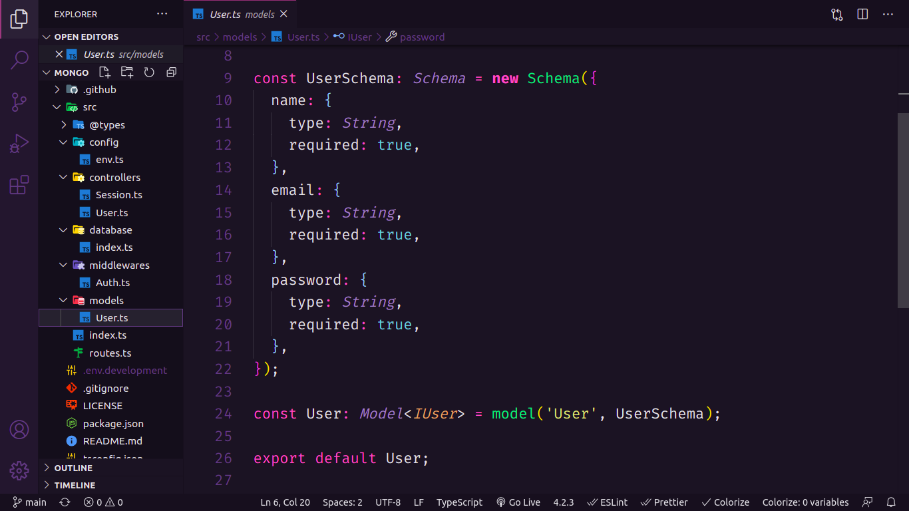

<p align="center">
  <h3 align="center">CRUD with MongoDB</h3>

  <p align="center">
    A simple CRUD using mongodb!
    <br />
    <a href="https://github.com/lucfersan/CRUD-mongodb"><strong>Explore the docs »</strong></a>
    <br />
    <br />
    ·
    <a href="https://github.com/lucfersan/CRUD-mongodb/issues">Report Bug</a>
    ·
    <a href="https://github.com/lucfersan/CRUD-mongodb/issues">Request Feature</a>
  </p>
</p>

## About The Project



I wanted to practice programming with a NoSQL database, that's why I choose mongoDB, which is very simple to learn.

I used prettier to give the code a pattern.

I worked with docker to create the containers for the database.

### Built With

- [Typescript](https://www.typescriptlang.org/)
- [Bcrypt](https://www.npmjs.com/package/bcrypt)
- [Prettier](https://prettier.io/)
- [Mongoose](https://mongoosejs.com/)

### Installation

1. Clone the repo
   ```sh
   git clone https://github.com/lucfersan/CRUD-mongodb
   ```
2. Install NPM packages
   ```sh
   yarn
   ```
3. Create a docker container
   ```sh
   docker run --name auth-mongo -p 27017:27017 -d mongo
   ```

## Contributing

Contributions are what make the open source community such an amazing place to be learn, inspire, and create. Any contributions you make are **greatly appreciated**.

1. Fork the Project
2. Create your Feature Branch (`git checkout -b feature/AmazingFeature`)
3. Commit your Changes (`git commit -m 'Add some AmazingFeature'`)
4. Push to the Branch (`git push origin feature/AmazingFeature`)
5. Open a Pull Request

## License

Distributed under the MIT License. See `LICENSE` for more information.

## Contact

Lucas Fernandes - fernandes.lucas11@outlook.com

Project Link: [https://github.com/lucfersan/CRUD-mongodb](https://github.com/lucfersan/CRUD-mongodb)
